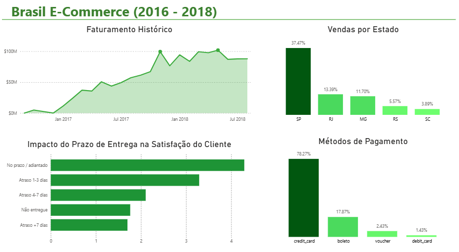
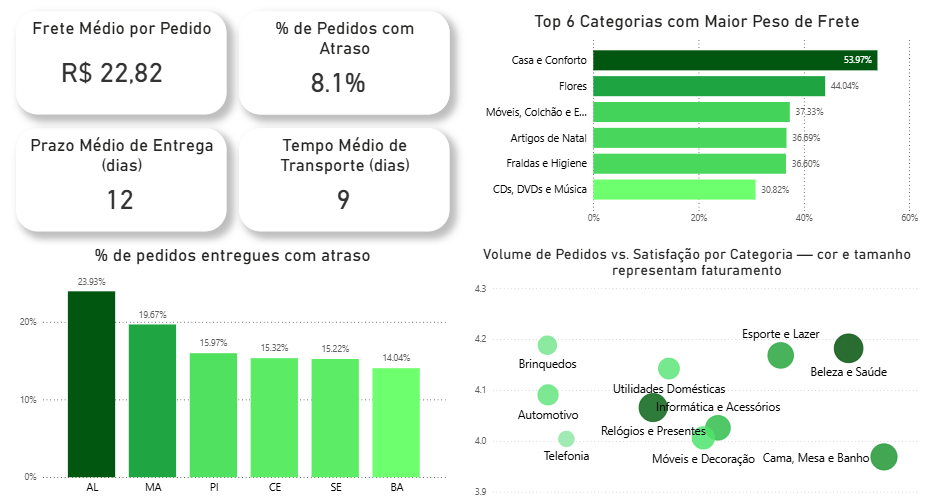

# Brasil E-Commerce (2016–2018) | Análise de Dados e Inteligência de Negócio (Olist)

## Visão Geral

Este projeto é uma análise exploratória, diagnóstica e visual sobre o mercado de e-commerce brasileiro, fundamentada no dataset público da **Olist** (disponível no Kaggle). O verdadeiro desafio deste projeto vai muito além da simples plotagem de gráficos: trata-se de transformar mais de 100 mil transações comerciais em **insights acionáveis**.

O objetivo central foi mapear a jornada completa de compra do consumidor brasileiro, desde o momento da finalização do carrinho até a porta de sua casa, cruzando faturamento, infraestrutura logística, falhas de operação e, em última instância, a percepção de valor do cliente.

As principais perguntas norteadoras da análise foram:
- Onde está concentrada a força motriz financeira do e-commerce brasileiro?
- Qual é o método preferido do brasileiro na hora do checkout e como isso afeta o caixa?
- Qual é o impacto real e matemático que um dia de atraso logístico gera na reputação da marca?
- A geografia do Brasil pune operações fora do eixo central? Quais regiões demandam intervenção urgente?
- Existe relação entre o tamanho/peso de uma categoria de produto e a frustração do cliente?

---

## Engenharia e Arquitetura de Dados

Para viabilizar uma análise de 360 graus, foi necessário dominar o modelo relacional intrincado (modelo *Snowflake/Star Schema*) fornecido. O ecossistema da Olist não é uma tabela plana; os dados estão segmentados por responsabilidades.

Abaixo, a topologia de conexão utilizada no projeto. Utilizamos a entidade **Pedidos** (`olist_orders_dataset`) e **Itens** (`olist_order_items_dataset`) como os corações do modelo, permitindo relacionamentos *Many-to-One* (M:1) que conectam o histórico de pagamento do cliente com a geografia do vendedor e a satisfação no final da esteira.

  

---

## Deep Dive: Análises Comerciais e Comportamento do Cliente

A primeira etapa da visualização foca no diagnóstico de receita, distribuição de riqueza e aderência ao meio de pagamento.

  

### 1. Faturamento Histórico: Da Tração à Escala
O gráfico de série temporal demonstra o momento exato em que a plataforma ganhou tração de mercado. No início de 2017, a curva sofre um pico agressivo de expansão — momento em que o modelo valida seu "*Product-Market Fit*". Ao longo de 2018, o faturamento estabiliza-se num teto alto. O desafio do negócio deixa de ser "vender mais" e passa a ser "manter o nível de serviço operando em alta escala".

### 2. A Hegemonia do Eixo Sul-Sudeste
Os indicadores geográficos revelam que **mais de 60% de todas as vendas do Brasil** estão concentradas em um núcleo de 4 estados: SP, RJ, MG e RS. O poder de compra é brutalmente polarizado, com o estado de São Paulo liderando isoladamente (37.47%). Isso sugere que o marketing da empresa é altamente engajado nessas frentes e a malha logística local provavelmente atende bem à demanda.

### 3. A Cultura do Cartão de Crédito
O brasileiro escolhe o **Cartão de Crédito em 78.27% das vezes**, evidenciando que compras on-line estão diretamente ligadas ao limite parcelado. Para o negócio, isso é um bônus com ressalvas: aumenta absurdamente a conversão por ser aprovação imediata (acelerando a esteira logística), mas eleva os custos da empresa com taxas cobradas por gateways de pagamento e riscos de *chargebacks* (fraudes). O volume expressivo do Boleto (~18%) requer processos paralelos, já que o tempo de compensação bancária (1 a 3 dias úteis) adiciona "gordura" indesejada ao prazo limite de entrega.

### 4. O Preço Reputacional do Atraso (SLA vs NPS)
Sem dúvidas, este é um dos insights mais vitais do projeto. Existe um alinhamento direto e cruel entre **tempo de transporte e insatisfação nítida**.  
- Encomendas no prazo ou adiantadas garantem avaliações altas, beirando a excelência (acima de 4.0 no sistema de pontos).  
- Contudo, **um pequeno deslize de 1 a 3 dias no atraso derruba brutalmente a nota para a zona de alerta (próximo a 3.2)**. 
- Quando o atraso cruza a margem crítica de 7 dias, a frustração do cliente se equipara praticamente ao sentimento de um pedido *nunca entregue*. A confiança do consumidor brasileiro não sobrevive à imprecisão logística.

---

## O Desafio Nacional: Logística, Gargalos Regionais e Densidade

Na segunda camada do painel, mudamos o foco da "venda" prateleira para as "rodovias", onde a operação física é posta à prova.

  

### 1. Indicadores Base Saudáveis, mas Escondem Extremos
Se olharmos os KPIs gerais, uma operação com fretamento médio de **R$ 22,82**, 9 dias médios no caminhão para 12 dias de promessa de entrega mostra que a operação global funciona, deixando uma robusta margem de manobra (3 dias) para o vendedor embalar e despachar. Mas o indicador de **8.1% de falha nos envios de forma global** em uma empresa de escala milionária representa *dezenas de milhares de clientes furiosos* impactando a retenção ($).

### 2. O Gargalo Silencioso da Região Nordeste ⚠️
O gráfico de "*% de pedidos com atraso por UF*" quebra o mito de que o atraso é distribuído de forma igual pelo país. **O gargalo logístico é majoritariamente nordestino.**
Estados como **Alagoas (quase 24% de pedidos atrasados)**, Maranhão (19.67%), Piauí e Ceará representam um alto índice de falhas de *Service Level Agreement (SLA)*. 
Como as bases vendedoras e os centros de distribuição estão no sudeste, o percurso de alto trajeto (*long-haul*) esbarra frequentemente na infraestrutura precária do final de cadeia. Sem revisar suas estimativas com o cliente, a Olist queima sistematicamente dinheiro e mercado nessa região.

### 3. O Dilema do Peso vs. Categoria no Transportes
O conjunto à direita do painel demonstra informações correlacionadas reveladoras sobre gestão de portfólio.
* Itens com as **maiores fatias do custo de frete**, como "*Casa e Conforto*" (>53%) e "*Móveis/Colchões*", são produtos desajeitados, com alto peso cubado que não fluem agilmente pelas esteiras das transportadoras rodoviárias comuns.
* Cruzando essa informação com o gráfico de dispersão (bolhas) na base da imagem, a métrica explode: categorias de itens "pesados" como **Móveis e Decoração** ou **Cama, Mesa e Banho** são **bolhas imensas** (puxam rios de dinheiro em faturamento), porém possuem **as piores avaliações médias (abaixo de 4.0)** de todo o ecossistema. 
* Em contrapartida, nichos como **Beleza e Esportes** puxam bons faturamentos mas pontuam na excelência: são fáceis de encaixotar, transportar via frete aéreo e chegam rápido e intactos nas mãos do consumidor final.

---

## Conclusão de Negócios e Planos de Ação

Como desfecho, esta análise de dados levanta direções de negócio contundentes de melhoria e contenção de danos operacionais:

1. **Readequação Sensível do Prazo para o Nordeste:** É provável que o algoritmo responsável por prometer o dia entrega no momento do carrinho não conheça inteiramente o desafio *last-mile* das estradas periféricas do nordeste. Recalcular o tempo estimado adicionando uma gordura técnica de dias é vital. É melhor prometer a entrega para um prazo mais longo e cumpri-lo, do que prometer rápido, atrasar, e receber de volta processos e avaliações negativas destrutivas.
2. **Clusterização de Transportadoras por Arquétipos:** Categorias densas ("Móveis") derrubam a satisfação devido aos percalços do transporte e quebras. Demandamos parcerias com transportadores focados em "*cargas fracionadas pesadas*" e não o clássico furgão de envios tradicionais de e-commerce.
3. **Escalar o Vertical Leve:** Estratégias de Marketing devem promover duramente o ecossistema de *Bem-Estar, Beleza e Esportes*. São categorias testadas e validadas: alto faturamento, baixo entrave logístico e alta retenção positiva do comprador.
4. **Alvo nos Meios de Pagamento:** Estimular campanhas de *"Cashback*" ou "*Desconto à vista*" usando PIX/Débito para fugir das pesadas parcelas consumidas nos cartões de crédito (fatia de 78%).

---
*Análise desenvolvida a título de enriquecimento de base em Data Warehouse e Visualização de Dados (Data Viz)*
